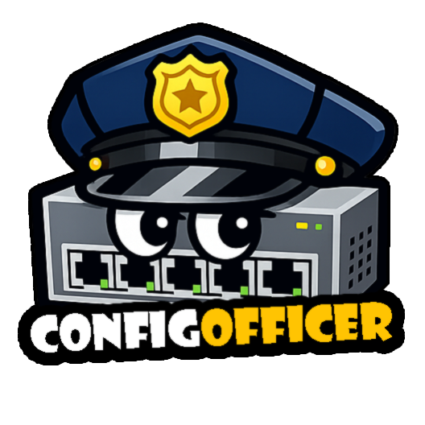

<p align="center">

</p>

# NetBox Config Officer Plugin

[](https://pypi.org/project/netbox-plugin-config-officer-2/)
[](https://pypi.org/project/netbox-plugin-config-officer-2/)
[](LICENSE)

A [NetBox](https://github.com/netbox-community/netbox) plugin for collecting Cisco device configurations, tracking changes over time, and auditing compliance with predefined templates. Forked from [artyomovs/netbox-plugin-config-officer](https://github.com/artyomovs/netbox-plugin-config-officer) and updated for NetBox 4.x.

**Features:**

- Collect running configuration and version info from Cisco devices via SSH
- Store configs in a Git repository and display diffs in NetBox
- Schedule automatic collection from specified devices
- Define configuration templates per device role or type and audit compliance
- Export compliance results to CSV
- Automatically create interfaces, LAGs, and IP addresses in NetBox from device config

## Preview

> Collect device data:
> 

> Template compliance:
> 

---

## Installation

> These instructions assume a standard NetBox installation managed with pip. For general plugin installation guidance see the [official NetBox docs](https://netbox.readthedocs.io/en/stable/plugins/).

### 1. Install system dependencies

The plugin connects to devices over SSH and interacts with Git. Make sure the following packages are available on the system running NetBox:

```shell
# Debian / Ubuntu
apt-get install -y git openssh-client
```

### 2. Install the plugin

Activate the NetBox virtual environment, then install the plugin and its Python dependencies:

```shell
source /opt/netbox/venv/bin/activate
pip install netbox-plugin-config-officer-2
```

To ensure the plugin is automatically reinstalled during future NetBox upgrades:

```shell
echo netbox-plugin-config-officer-2 >> /opt/netbox/local_requirements.txt
```

### 3. Run database migrations

```shell
cd /opt/netbox/netbox
python manage.py migrate config_officer
```

### 4. Prepare the config storage directory

The plugin stores device configurations in a local directory that it manages as a Git repository. The plugin will initialise the Git repository inside it automatically on first run.

```shell
mkdir -p /opt/device_configs
```

The NetBox process (or the RQ worker, if you run one) must be able to read and write this directory. Set ownership to whichever user NetBox Worker runs as:

```shell
chown -R <netbox-user>:<netbox-user> /opt/device_configs
```

> If you are unsure which user NetBox runs as, check your systemd service file (`User=` field) or run `ps aux | grep netbox`.

### 5. Enable and configure the plugin

Add `config_officer` to `PLUGINS` in your `configuration.py`, and add a `PLUGINS_CONFIG` block. The only required settings are `NETBOX_DEVICES_CONFIGS_REPO_DIR` and the device credentials:

```python
PLUGINS = ["config_officer"]

PLUGINS_CONFIG = {
    "config_officer": {
        # REQUIRED - path to the directory prepared in step 4
        "NETBOX_DEVICES_CONFIGS_REPO_DIR": "/opt/device_configs",

        # REQUIRED - credentials used to SSH into devices
        "DEVICE_USERNAME": "cisco",
        "DEVICE_PASSWORD": "cisco",
    }
}
```

All other settings are optional and documented in the [Configuration](#configuration) section below.

### 6. Restart NetBox

```shell
systemctl restart netbox netbox-rqworker
```

### 7. Create Custom Fields in NetBox (optional)

These fields store collection metadata on each device. Create them under **dcim > device** and make sure their names match the `CF_NAME_*` values in your config (defaults shown below):

| Name | Label | Type |
|---|---|---|
| `version` | Software version | Text |
| `ssh` | SSH enabled | Boolean |
| `last_collect_date` | Date of last collection | Text |
| `last_collect_time` | Time of last collection | Text |

---

## Configuration

All settings can be provided in `PLUGINS_CONFIG` or as environment variables. Environment variables take priority. The env var name for each setting is `CO_<KEY>` unless noted otherwise.

### Required

| Setting | Env var | Description |
|---|---|---|
| `CONFIGS_REPO_DIR` | `CO_CONFIGS_REPO_DIR` | Path to the directory where device configs are stored. Must exist; the plugin initialises the Git repo inside it on first run. |
| `DEVICE_USERNAME` | `CO_DEVICE_USERNAME` | SSH username for connecting to devices. |
| `DEVICE_PASSWORD` | `CO_DEVICE_PASSWORD` | SSH password for connecting to devices. |

### Optional

#### SSH

| Setting | Env var | Default | Description |
|---|---|---|---|
| `DEVICE_SSH_PORT` | `CO_DEVICE_SSH_PORT` | `22` | SSH port used for all devices. |
| `DEFAULT_PLATFORM` | `CO_DEFAULT_PLATFORM` | `nxos` | Default scrapli driver/platform used when a device has no platform set in NetBox. |

#### Config storage

| Setting | Env var | Default | Description |
|---|---|---|---|
| `CONFIGS_SUBPATH` | `CO_CONFIGS_SUBPATH` | `netbox` | Sub-directory inside the repo where config files are written. |

#### Remote Git

Push configs to a remote Git repository (GitHub, GitLab, etc.) after each collection. Configure via the `GIT_REMOTE` dict or individual env vars:

| Setting | Env var | Default | Description |
|---|---|---|---|
| `GIT_REMOTE.ENABLED` | `CO_GIT_REMOTE_ENABLED` | `True` | Enable or disable remote push. |
| `GIT_REMOTE.URL` | `CO_GIT_REMOTE_URL` | `None` | Remote URL (e.g. `git@github.com:org/repo.git`). Required if remote push is enabled. |
| `GIT_REMOTE.NAME` | `CO_GIT_REMOTE_NAME` | `origin` | Git remote name. |
| `GIT_REMOTE.BRANCH` | `CO_GIT_REMOTE_BRANCH` | `netbox` | Branch to push to. |
| `GIT_REMOTE.SSH_KEY_PATH` | `CO_GIT_REMOTE_SSH_KEY_PATH` | `None` | Path to the SSH private key used for remote authentication. |
| `GIT_REMOTE.AUTHOR` | `CO_GIT_REMOTE_AUTHOR` | `Netbox <netbox@example.com>` | Git author string for commits. |

#### Custom field names

Only needed if you named your custom fields differently from the defaults:

| Setting | Default |
|---|---|
| `CF_NAME_SW_VERSION` | `version` |
| `CF_NAME_SSH` | `ssh` |
| `CF_NAME_LAST_COLLECT_DATE` | `last_collect_date` |
| `CF_NAME_LAST_COLLECT_TIME` | `last_collect_time` |

#### Feature flags

| Setting | Env var | Default | Description |
|---|---|---|---|
| `COLLECT_INTERFACES_DATA` | `CO_COLLECT_INTERFACES_DATA` | `True` | Create/update interfaces in NetBox from device config. |
| `COLLECT_PORT_CHANNEL_DATA` | `CO_COLLECT_PORT_CHANNEL_DATA` | `True` | Create/update LAGs in NetBox from device config. |

#### Config sanitisation

| Setting | Default | Description |
|---|---|---|
| `SENSITIVE_PREFIXES` | `username`, `ssh`, `snmp-server user`, `crypto`, `key`, `password` | Lines whose first word matches any of these prefixes are redacted before the config is saved. |
| `VOLATILE_LINE_PATTERNS` | Timestamp and `ntp clock-period` patterns | Regex patterns - matching lines are stripped before diffing so they don't produce false-positive changes. |

---

## Usage

### Collecting device configurations

 **Collect Device Data** and **Show Running Config** buttons should appear on each device page. Clicking **Collect Device Data** pulls the current running config via SSH and commits it to the configured Git repository.

### Template compliance

After installation a **Plugins** menu appears in the top navigation bar. Template compliance follows a three-step workflow:

1. **Add a template** - define a configuration block that devices should conform to.
2. **Add a service** - group one or more templates and bind them to specific device roles or types via service rules.
3. **Attach the service to devices** - all matched templates are merged into a single combined template and compared against each device's running config.

Compliance results can be exported to CSV from the compliance list view.


### Scheduled collection

Planned collection across all devices can be scheduled directly from the **Schedule Data Collection** menu under **Plugins** in the top navigation bar.


---

## Development

See [CONTRIBUTING.md](CONTRIBUTING.md) for the full development setup guide, including how to run a local NetBox stack with Docker Compose, the pre-commit hook setup, and commit message conventions.

---

## License

[Apache License 2.0](LICENSE)
